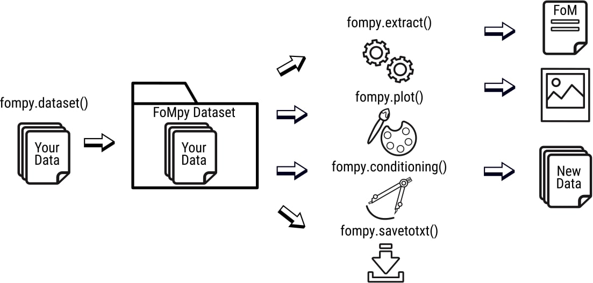

FoMpy: A figure of merit extraction tool for semiconductor device simulations
===============

What is this?
+++++++++++++

* This is a `FoMpy <https://github.com/gabrielesp/FoMpy/>`__ tutorial introduction, where you will learn how to use the basic capabilities of the FoMpy library.
.. * By `Gabriel Espiñeira <https://github.com/>`__.
.. * February 20, 2019.

The source code of FoMpy can be downloaded from https://github.com/gabrielesp/FoMpy and is purely intended to run as a library for Linux systems. Note that the following instalation steps work on Debian-derived distributions: e.g. for Ubuntu 16.04 or later and CentOS (tested). Also, FoMpy has been proven to work in **Python 3.5.4**.
FoMpy uses several external libraries that need to be installed in order to be able to use the full functionality of the tool. A list of these libraries can be seen below:

	* setuptools
	* numpy
	* scipy
	* matplotlib
	* pytest
	* probscale

Most of these modules will be installed automatically when installing FoMpy. The pytest module is not listed as a hard dependency so you will have to install it beforehand.

Currently FoMpy can be downloaded from https://pypi.org/project/fompy/ through the following url using pip3::

	pip install fompy

Detailed instalation steps can be found futher down this tutorial and further documentation on the FoMpy library can be found inside FoMpy.pdf .

1. Introduction
---------------

FoMPy is an effective tool that extracts the main figures of merit (FoM) of a semiconductor's IV curve and provides useful statistical parameters for variability studies. It includes several methods to extract the threshold voltage. 

In the figure below the user can see the basic workflow behind the FoMpy library:

After loading the data into a FoMpy Dataset, using the various tools implemented in the library, the user is able to process and extract important parameters of the given curves.

2. Installation
---------------

First you need to have installed **pip3** on your system. For Ubuntu, open up a terminal and type::

	sudo apt update

	sudo apt install python3-pip

The use of virtual environments is highly encouraged. The main purpose of Python virtual environments is to create an isolated environment for Python projects so that no modular dependency issues with other projects can appear. In order to use them run the following commands in a terminal::

	#Install virtual environments
	sudo apt install python3-venv 

	#Create and name the environment "venv"
	python3 -m venv .venv

	#Activate the venv
	source .venv/bin/activate

Note that as of this moment you're inside a virtual environment (Notice (.venv) $ in the terminal) with a limited/isolated version of python and therefore you will have to install all the packages you need for that particular project (including the ones you may have installed in the system as they may not be installed in the virtual environment).

**Instalation of FoMpy via pip3**

Run the following command in a terminal::

	pip install fompy

and check the library is installed by importing it from a **python3 terminal**::

 	import fompy

Unless an error comes up, FoMpy is now installed on your virtual environment.

**Note: Most of the packages will be installed automatically during the FoMpy instalation. If you experience some issue, you can try to install the needed modules them yourself by typing in a terminal**::
	
	pip3 install setuptools
	pip3 install pytest
	pip3 install numpy
	pip3 install scipy
	pip3 install probscale
	pip3 install matplotlib
	sudo apt-get install python3-tk #optional

3. Quickstart 
-------------

In this section the user can learn the most basic yet powerful commands implemented in the FoMpy library. In order to do so either start by reading the basic commands or 
download and try the exampled provided in the repository explained at the end of this page.

Basic commands
+++++++++++++++++

A bunch of useful FoMpy commands are now provided. Supported tools include fompy.extract, fompy.plot or fompy.savetotxt. Here are some quick examples of the core capabilities of FoMpy:

In order to load a FoMpy Dataset run inside a **python3 terminal**::

	import fompy

FoMpy implements an importing tools that allows the user to extract the data from various sources
(from a file, an array stored in memory, etc).

**1.Import from a file**

For example if the user wishes to import IV curves stored in a general way (with a header plus a voltage and current columns)::
	
	#VG	#ID
	0.0	3.00E-09
	0.1	2.18E-08
	0.2	3.77E-07
	0.3	2.74E-06
	0.4	9.33E-06
	0.5	1.87E-05
	0.6	2.97E-05
	0.7	3.96E-05
	0.8	5.43E-05
	0.9	5.98E-05
	1.0	6.60E-05

One approach to create a FoMpy Dataset is::

	import fompy

	path = './path_to_file'
	fds = fompy.dataset(path, parser=fompy.file)

	print(fds.dataset) 
	
**2.Import from an array**

Additionally if the user already has the IV curves loaded in an array the process is similar to the previously explained::

	import fompy
	import numpy as np

	arr1 =np.array([[0.00e+00, 1.00e-09],
		       [1.00e-01, 2.20e-08],
		       [2.00e-01, 3.20e-07],
		       [3.00e-01, 2.74e-06],
		       [4.00e-01, 9.90e-06],
		       [5.00e-01, 2.20e-05],
		       [6.00e-01, 3.22e-05],
		       [7.00e-01, 4.16e-05],
		       [8.00e-01, 5.23e-05],
		       [9.00e-01, 6.04e-05],
		       [1.00e+00, 6.60e-05]])
		       
	arr2 =np.array([[0.00e+00, 1.00e-09],
		       [1.00e-01, 2.15e-08],
		       [2.00e-01, 3.18e-07],
		       [3.00e-01, 2.72e-06],
		       [4.00e-01, 9.85e-06],
		       [5.00e-01, 2.12e-05],
		       [6.00e-01, 3.16e-05],
		       [7.00e-01, 4.10e-05],
		       [8.00e-01, 5.46e-05],
		       [9.00e-01, 6.15e-05],
		       [1.00e+00, 6.57e-05]])

	arrays = np.stack((arr1, arr2)) #Here the arrays are put together
	fds = fompy.dataset(arr = arrays, parser=fompy.array)

	print(fds.dataset)

Also for a single IV curve::

	import fompy
	import numpy as np
	x = ([0.0, 0.1, 0.2, 0.3, 0.4, 0.5, 0.6, 0.7, 0.8, 0.9, 1.0])
	y = ([1.00e-09, 2.20e-08, 3.20e-07, 2.74e-06, 9.90e-06, 2.20e-05, 3.22e-05, 4.16e-05, 5.23e-05, 6.04e-05, 6.60e-05])
	fds = fompy.iv(arr = (x,y), parser=fompy.curve)
	print(fds.dataset)

Note that all the operations of FoMpy are dependant on how the Dataset is created, therefore try to concatenate several arrays according to the previous example.

**3.Import from an JCJB used in VENDES simulator[#]_**

Finally, FoMpy has predefined a parser thath reads an in-house format called 'JCJB'. In order to load the dada from these files, FoMpy has a importing tool with an input parameter for the parser. Inside the folder './data/' the user has to store all simulations in individual folders (i.e. './data/sim_1/current_file_1.txt', './data/sim_2/current_file_2.txt', etc)::

	path_data = './data'
	fds = fompy.dataset(path_data, parser=fompy.JCJB)

Note that the defined path has to point to the parent directory of the folders containing the single IV curve files.

After running this, a Fompy Dataset is created and the IV curves are stored inside it.
They can be accessed by calling the dataset attribute::

	print(fds.dataset)

**4.FoMpy Dataset**

Now that the Fompy Dataset has been implemented several other parameters can be defined like the
number of simulations (fds.n_sims) or a value for normalizing the curves (fds.norm)., the default extraction
method (fds.ext_method), the drain bias for the ensemble of curves (fds.drain_bias), the drain bias value
(fds.drain_bias_value) and the default interpolation method (fds.interpolation). All these parameters can be defined/updated
like the following example (Note that some of them will be defined automatically, like the number of simulations,
once the IV curves are loaded)::

	fds.drain_bias_value = 0.66

Also a predefined function can be called in order to print the current value of the attributes of the selected Fompy Dataset::

	fds.print_parameters()

**5.Parameter extraction**

The most important capability of Fompy is that it allows the user to extract the most common figures of merit (FoM)
of a semiconductor's IV curve using different methodologies. In order to extract these FoM the user has to call the 
function extract. The following example extracts the threshold voltage values :math:`\mathrm{V_{TH}}` of the curves in the Fompy Dataset::

	vth_array = fompy.extract(fds, fom = 'vth')

and write the results to a file::

	fompy.savetotxt('./results_vth.txt', 'vth', vth_array)

Note that since no extraction method has been defined the library uses the second derivative method ('SD') as a default. 
This can be changed to other commonly used methods like the constant current method, the third derivative or the linear extrapolation (See further instructions on how to choose this in the full documentation). The theory behind these extraction methodologies and case results can be found in [#]_ [#]_

**6.Plotting the results**

FoMpy also has built-in several plotting capabilities to be able to check the extraction results. A simple plot
of the threshold voltage with the 'SD' method and the second derivative of the curve goes as follows::

	fompy.plot(fds, fom = 'vth', save_plot='./vth_plots/sd/')

Two common backends are available when using FoMpy:'Agg'(default), which only works whenever saving plots to files (non-GUI) and 'TkAgg' a GUI tool for visualizing the plots on a pop-up window.
Note that 'TkAgg' requires the package python3-tk installed in order to run. Also the plots have been saved to the path './vth_plots/sd/', keeping the indexing of the curves as stored in the Fompy Dataset.

Repository Example
+++++++++++++++++++

A simple example is included with the code so the user can test some basic commands and check the library
works as intended in their systems. After grabbing this repostiroty::

	git clone https://gitlab.citius.usc.es/gabriel.espineira/FoMPy/
	cd FoMPy-master

in the directory FoMpy-master, a file called ``example.py`` with command examples and a folder containing ensembles of simulated IV curves are included inside the path './data'. 

In order to test it comment and uncomment the lines that you want to run inside example.py and in a **python3 terminal** type::

	python3 example.py

Citing FoMpy
+++++++++++++++++++

Please cite FoMpy in your publications if it helps your research::

	@INPROCEEDINGS{fompy2018,
	author={G. {Espiñeira} and N. {Seoane} and D. {Nagy} and G. {Indalecio} and A. J. {García-Loureiro}},
	booktitle={2018 Joint International EUROSOI Workshop and International Conference on Ultimate Integration on Silicon (EUROSOI-ULIS)},
	title={FoMPy: A figure of merit extraction tool for semiconductor device simulations},
	year={2018},
	pages={1-4},
	doi={10.1109/ULIS.2018.8354752},
	ISSN={2472-9132},
	month={March},}

References
+++++++++++++++++++

.. [#] VENDES. A.J.Garcia-Loureiro, N.Seoane, M.Aldegunde, R.Valin, A.Asenov, A.Martinez and K.Kalna “Implementation of the Density Gradient Quantum Corrections for 3-D Simulations of Multigate Nanoscaled Transistors”, IEEE Trans. Comput.-Aided Des. Integr. Circuits Syst, doi=10.1109/TCAD.2011.2107990 
.. [#] G.Espiñeira, N.Seoane, D.Nagy, G.Indalecio and A.J.García Loureiro, “FoMPy: A figure of merit extraction tool for semiconductor device simulations” in 2018 Joint International EUROSOI Workshop and International Conference on Ultimate Integration on Silicon (EUROSOI-ULIS) doi :10.1109/ULIS.2018.8354752
.. [#] G.Espiñeira, D.Nagy, G.Indalecio, A.J.García Loureiro and N.Seoane, “Impact of threshold voltage extraction methods on semiconductor device variability” in Solid-State Electron, https://doi.org/10.1016/j.sse.2019.03.055

