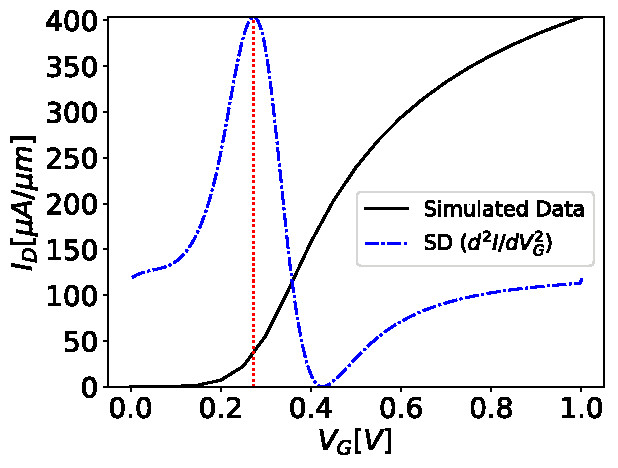
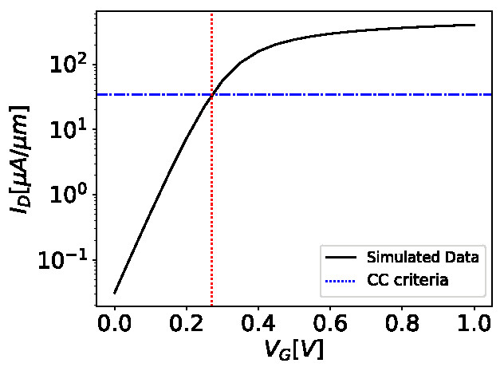
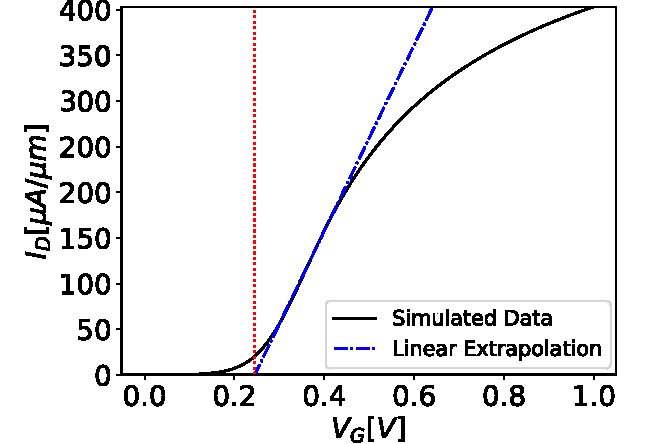

.. FoMpy documentation master file, created by
   sphinx-quickstart on Fri Feb  8 16:55:44 2019.
   You can adapt this file completely to your liking, but it should at least
   contain the root `toctree` directive.

Welcome to FoMpy's documentation!
=================================

.. toctree::
   :maxdepth: 2
   :caption: Contents:

	

=================================
Getting Started
=================================

FoMPy is an effective tool that extracts the main figures of merit (FoM) of a semiconductor's IV curve and provides useful statistical parameters for variability studies. It includes several methods to extract the threshold voltage. 

In the figure below the used can see the basic workflow behind the FoMpy library:

.. figure:: ./figs/simplified_diagram.jpg
    :width: 600px
    :align: center
    :height: 400px
    :alt: alternate text
    :figclass: align-center

    Diagram showing the basic methodology of the FoMpy library. After loading the data into a FoMpy Dataset, using the various tools implemented in the library, the user is able to process and extract important parameters from a given dataset.

^^^^^^^^^^^^^^^^^^^^^^^^^^^^^^^^^
Getting FoMpy
^^^^^^^^^^^^^^^^^^^^^^^^^^^^^^^^^

The source code of FoMpy can be downloaded from https://gitlab.citius.usc.es/gabriel.espineira/FoMPy/ and is purely intended to run as a library for Linux systems (Debian, Ubuntu, FreeBSD, ...). FoMpy uses several external libraries that need to be installed in order to be able to use the full functionality of the tool. A list of these libraries can be seen below:

setuptools>=21.0.0 

numpy>=1.10.0

scipy>=0.8.0

matplotlib>=3.0.2

First you need to have installed pip on your system. Open up a terminal and type::

	sudo apt update

	sudo apt install python3-pip

Once the installation is complete, verify the installation by checking the pip version::

	pip3 --version

The use of virtual enviroments is highly encouraged. In order to use them run the following commands in a terminal::

	sudo apt install python3-venv
	python3 -m venv .venv
	source .venv/bin/activate

Note that as of this moment you're inside a virtual enviroment (Notice (.venv) $ in the terminal) with a limited version of python and therefore you will have to install all the packages you need (including the ones mentioned above because they are installed in the system, not the virtual enviroment).

.. and then::
	
.. 	python -m pip3 install -r requirements.txt

To check the version available of a package on your system type in a terminal::

	python3 -c "import numpy; print(numpy.version.version)"

and the version that is currently installed of numpy on your system will be printed.

.. Run in a terminal again::

.. 	pip install <library>
..	sudo apt install python3-tk

Via pip (recommended)

Run the following command in a terminal::

	pip3 install --extra-index-url https://test.pypi.org/simple/ fompy

and check the library is installed by importing it from a **python3 terminal**::

 	import fompy

Unless an error comes up, FoMpy is now installed on your virtual enviroment.

.. Via conda (not working)
 
.. Run the following command in a terminal::
 
.. 	conda search fompy

.. 	conda install fompy
 
.. Via source code (not working)
 
.. Go to https://github.com/ and download the project. Go to the parent folder and run::
 
..	make
 
.. and
	
.. make install

^^^^^^^^^^^^^^^^^^^^^^^^^^^^^^^^^
Quick Start
^^^^^^^^^^^^^^^^^^^^^^^^^^^^^^^^^

In this section the user can learn the most basic yet powerful commands implemented in the FoMpy library. In order to do so either start by reading the basic commands or 
download and try the exampled provided in the repository explained at the end of this page.

Basic commands
+++++++++++++++++

A bunch of useful FoMpy commands are now provided. Supported tools include fompy.extract, fompy.plot or fompy.savetotxt. Here are some quick examples of the core capabilities of FoMpy:

In order to load a FoMpy Dataset run inside a **python3 terminal**::

	import fompy

FoMpy implements an importing tools that allows the user to extract the data from various sources
(from a file, an array stored in memory, a Sentaurus output file, etc). Inside the folder './data/' the user has to store all simulations in individual folders (i.e. './data/sim_1/current_file_1.txt', './data/sim_2/current_file_2.txt', etc)::

	path_data = './data'
	fds = fompy.dataset(path_data, parser=fompy.JCJB)

Note that the defined path has to point to the parent directory of the folders containing our single curve files.

After running this, a Fompy Dataset is created and the IV curves are stored inside it.
They can be accessed by calling the dataset attribute::

	print(fds.dataset)

Now that the Fompy Dataset has been implemented several other parameters can be defined like the
number of simulations (fds.n_sims) or a value for normalizing the curves (fds.norm)., the default extraction
method (fds.ext_method), the drain bias for the ensemble of curves (fds.drain_bias), the drain bias value
(fds.drain_bias_value) and the default interpolation method (fds.interpolation). All these parameters can be defined/updated
like the following example (Note that some of them will be defined automatically, like the number of simulations,
once the IV curves are loaded)::

	fds.drain_bias_value = 0.66

Also a predefined function can be called in order to print the current value of the attributes of the selected Fompy Dataset::

	fds.print_parameters()

The most important capability of Fompy is that it allows the user to extract the most common figures of merit (LATEX FOM)
of a semiconductor's IV curve using different methodologies. In order to extract these FoM the user has to call the 
function extract. The following example extracts the threshold voltage values (LATEX VTH) of the curves in the Fompy Dataset::

	vth_array = fompy.extract(fds, fom = 'vth')

and write the results to a file::

	fompy.savetotxt('./results_vth.txt', 'vth', vth_array)

Note that since no extraction method has been defined the library uses the second derivative method ('SD') as a default. 
This can be changed to oterh commonly used methods like the constant current method, the third derivative or the linear extrapolation (See further instructions
on how to choose this in the full documentation).

FoMpy also has built-in several plotting capabilities to be able to check the extraction results. A simple plot
of the threshold voltage with the 'SD' method and the second derivative of the curve goes as follows::

	fompy.plot(fds, fom = 'vth', save_plot='./vth_plots/sd/')

Note that the plots have been saved to the path './vth_plots/sd/', keeping the indexing of the curves as stored in the Fompy Dataset.

=================================
Importing your data
=================================

.. ^^^^^^^^^^^^^^^^^^^^^^^^^^^^^^^^^^^^^^^^^^
.. FromArray(TODO)
.. ^^^^^^^^^^^^^^^^^^^^^^^^^^^^^^^^^^^^^^^^^^

^^^^^^^^^^^^^^^^^^^^^^^^^^^^^^^^^^^^^^^^^^
From a file
^^^^^^^^^^^^^^^^^^^^^^^^^^^^^^^^^^^^^^^^^^

In order to load a FoMpy Dataset the user needs to import fompy and specifically dataset tool to load the values from a file::

	dataset(path, parser, save_to_file, interval , exclude)

where the arguments of the function are:

* str path: path to the parent directory containing the folders where the IV curves are.

* fn parser: function defining the format of the curves.

* str save_to_file: path where the user wants to save the FoMpy Dataset.

* [int, int] interval: list containing the start and end index of the curves to import.

* int exclude: Index of a curve that the user wishes to exclude from the Fompy Dataset.

By default only the path and the parser have to be defined. Additional functionalities are implemented, like saving all the IV curves to a single file with a header
indicating the curve id. Morevover the user is able to define an interval of curves to load into the dataset, discarding the rest or define single curves from the dataset.

If additional parameters of the dataset want to be defined, i.e. a normalization value for all the curves or a default extraction method, the user can simple access these dataset attributes doing ``fds.norm = 100``.

An example of how to load the curves to a FoMpy Dataset can be seen below::

	import fompy

	path_file = './data/sim_FinFET_vd_high/'

	path_to_save='./sim_data.dat'

	fds = fompy.dataset(path_to_file, parser='JCJB', save_to_file = path_to_save)

	fds.norm = 35.8 
	fds.ext_method = 'SD' 
	fds.drain_bias = 'high'
	fds.print_parameters()

	>>   Number of simulations:  5
	>>   Normalization value:  35.8
	>>   Extraction method:  'SD'
	>>   Drain Bias label:  'high'
	>>   Drain Bias value:  [0.7]

.. Defining a parser(TODO)
.. ^^^^^^^^^^^^^^^^^^^^^^^^^^^^^^^^^^^^^^^^^^

.. =================================
.. Conditioning your data(TODO)
.. =================================

^^^^^^^^^^^^^^^^^^^^^^^^^^^^^^^^^^^^^^^^^^
Interpolation
^^^^^^^^^^^^^^^^^^^^^^^^^^^^^^^^^^^^^^^^^^

VERY IMPORTANT TO EXPLAIN THAT FIRST WE HAVE TO DIFFERENTIATE THE DISCRETE SIMULATED CURVE AND THEN INTERPOLATE, NEVER 
IN THE OTHER ORDER.

^^^^^^^^^^^^^^^^^^^^^^^^^^^^^^^^^^^^^^^^^^
Differentiation
^^^^^^^^^^^^^^^^^^^^^^^^^^^^^^^^^^^^^^^^^^
EXPLAIN THE GRADIENT

.. ^^^^^^^^^^^^^^^^^^^^^^^^^^^^^^^^^^^^^^^^^^
.. norm
.. ^^^^^^^^^^^^^^^^^^^^^^^^^^^^^^^^^^^^^^^^^^

.. ^^^^^^^^^^^^^^^^^^^^^^^^^^^^^^^^^^^^^^^^^^
.. smooth(TODO)
.. ^^^^^^^^^^^^^^^^^^^^^^^^^^^^^^^^^^^^^^^^^^

.. ^^^^^^^^^^^^^^^^^^^^^^^^^^^^^^^^^^^^^^^^^^
.. filtering(TODO)
.. ^^^^^^^^^^^^^^^^^^^^^^^^^^^^^^^^^^^^^^^^^^

=================================
Extracting the FoM
=================================

^^^^^^^^^^^^^^^^^^^^^^^^^^^^^^^^^^^^^^^^^^
Threshold voltage (Vth)
^^^^^^^^^^^^^^^^^^^^^^^^^^^^^^^^^^^^^^^^^^

Generally, when performing variability studies, the parameters that characterize the $\mathrm{V_{T}}$ statistical distribution (e.g. standard deviation, mean value) are used as the main criteria to assess the impact of a variability source on the device's performance in the sub-threshold region \cite{TEDNATFINER}. However, a question that may arise is how independent the statistical results are from the selected $\mathrm{V_{T}}$ extraction method. For this reason, in this work we present a complete comparison of four commonly used extraction techniques (SD, CC, LE and TD), with the aim of establishing the impact that $\mathrm{V_{T}}$ extraction methods have on statistical variability studies. FoMpy has included four popular extraction methodologies found in the literature, a straightforward constant current, a geometrical linear extrapolation and two transconductance-based methods like the second and third derivatives.

Second Derivative
^^^^^^^^^^^^^^^^^^^^^^^^^^^^^^^^^^^^^^^^^^
The second derivative method, also called transconductance change method, is one of the most popular used methods. It evaluates :math:`\mathrm{V_{TH}}`  at the :math:`\mathrm{V_{G}}`  value where the derivative of the transconductance (:math:`g_{m}=dI_{D}/dV_{G}`) is maximum. In Figure ?, the IV curve for the device is plotted along with the :math:`\mathrm{V_{TH}}` extracted value where the red dotted line crosses the x-axis and the second derivative curve with the blue dashed line. A drawback of this method is its sensitivity to noise and error, as it acts as a high pass filter on the measured data. One way of solving it, is to apply additional smoothing techniques or numerical fitting.

    Second derivative (SD) method implementation (blue dashed line). The red dotted line indicates the position of :math:`\mathrm{V_{TH}}`.

Constant Current
^^^^^^^^^^^^^^^^^^^^^^^^^^^^^^^^^^^^^^^^^^

Traditionally the constant current method has been the preferred technique used to obtain the threshold voltage value in variability studies  \cite{ORTIZ} \cite{TEDNATFINER} \cite{IEDM_vt_normal_CC} due to its simplicity and speed. This method determines $\mathrm{V_{T}}$ at a critical user-defined value of the drain current  ($\mathrm{I_{Dcc}}$)  where the transition point from linear to saturation regime happens \cite{Schroder_book}. A general criteria is to consider  $\mathrm{I_{Dcc}}= W_{eff}/L_{G}\times I_{0}$, being $W_{eff} = 2 \times H_{CH}+W_{CH}$ the effective perimeter of the Si channel \cite{w_effective}, and $\mathrm{I_{0}}$ a constant current level \cite{CC_crit_fins} defined by the user depending on the studied device. A graphical depiction of this method can be seen in Fig.~\ref{fig:cc_method}.

    Constant current (CC) criteria applied to the FinFET device with a value of $I_{Dcc}=34.6~\mathrm{\mu A/\mu m}$ (blue dashed line).

Linear Extrapolation
^^^^^^^^^^^^^^^^^^^^^^^^^^^^^^^^^^^^^^^^^^

The linear extrapolation method is another widely used technique based on the quadratic law \cite{Schroder_book}. Ortiz et al. state that, using this method $\mathrm{V_{T}}$ is obtained as the gate voltage axis intercept of the tangent of the IV characteristics at its maximum first derivative (slope) point \cite{ORTIZ} (see Figure \ref{fig:le_method}).

    Linear Extrapolation (LE) method showing the extrapolated line (blue dashed line) intersecting with the x-axis at $V_{T}$ (red dotted line).

Third Derivative
^^^^^^^^^^^^^^^^^^^^^^^^^^^^^^^^^^^^^^^^^^

The third derivative method consists on choosing the $\mathrm{V_{T}}$ where the third derivative of the current ($d^{3}I_{D}/dV^{3}_{G}$) has a maximum (see Figure \ref{fig:td_method}). This extraction method disagrees with the SD method inherently as the values extracted from the maximums and minimums of the function always fall to the sides of the ones obtained with the SD method. Beside this, successive differentiation amplifies the noise, hence increasing the inestability, making it less reliable. To reduce this induced error fitting and smoothing techniques can be applied. 

.. figure:: ./figs/third_derivative.jpg
    :width: 400px
    :align: center
    :height: 300px
    :alt: alternate text
    :figclass: align-center

    Third derivative (TD) method (blue dashed line) plot showing the extracted $\mathrm{V_{T}}$ at the $\mathrm{V_{G}}$ point where the third derivative is maximum (red dotted line).

An example of how to extract the Vth from the curves in a FoMpy Dataset can be seen below::

	import fompy

	path_file = './data/sim_FinFET_vd_high/'

	path_to_save='./sim_data.dat'

	fds = fompy.dataset(path_to_file, parser='JCJB', save_to_file = path_to_save)

	#VTH EXTRACTION

	vth_array = fompy.extract(fds, fom = 'vth')
	print(vth_array)

	vth_array_cc = fompy.extract(fds, fom = 'vth', method = 'CC', cc_criteria=1.5e-6)
	print(vth_array_cc)

	vth_array_td = fompy.extract(fds, fom = 'vth', method = 'TD')
	print(vth_array_td)

	vth_array_le = fompy.extract(fds, fom = 'vth', method = 'LE')
	print(vth_array_le)

^^^^^^^^^^^^^^^^^^^^^^^^^^^^^^^^^^^^^^^^^^
Sub-threshold Slope (SS)
^^^^^^^^^^^^^^^^^^^^^^^^^^^^^^^^^^^^^^^^^^

An example of how to extract the SS from the curves in a FoMpy Dataset can be seen below::

	#SS EXTRACTION

	ss_array = fompy.extract(fds1 = fds, fom = 'ss')
	print(ss_array)

	ss_array = fompy.extract(fds1 = fds, fom = 'ss', vg_start = 0.05)
	print(ss_array)

	ss_array = fompy.extract(fds1 = fds, fom = 'ss', vg_start = 0.05, vg_end = 0.2)
	print(ss_array)

	ss_array = fompy.extract(fds1 = fds, fom = 'ss', vg_end = 0.2)
	print(ss_array)

^^^^^^^^^^^^^^^^^^^^^^^^^^^^^^^^^^^^^^^^^^
On-Off Current (Ion-Ioff)
^^^^^^^^^^^^^^^^^^^^^^^^^^^^^^^^^^^^^^^^^^

An example of how to extract the Ion and Ioff from the curves in a FoMpy Dataset can be seen below::

	#IOFF EXTRACTION

	ioff_array_0 = fompy.extract(fds, fom = 'ioff')
	print(ioff_array_0)
	ioff_array = fompy.extract(fds, fom = 'ioff', vg_ext = 0.2)
	print(ioff_array)

	#ION EXTRACTION

	ion_array_vg_defined = fompy.extract(fds, fom = 'ion',vg_ext = 0.7)
	print(ion_array_vg_defined)

	ion_array_default_SD = fompy.extract(fds, fom = 'ion')
	print(ion_array_default_SD)

	ion_array_LE = fompy.extract(fds, fom = 'ion',method = 'LE')
	print(ion_array_LE)

	ion_array_TD = fompy.extract(fds, fom = 'ion',method = 'TD')
	print(ion_array_TD)

^^^^^^^^^^^^^^^^^^^^^^^^^^^^^^^^^^^^^^^^^^
DIBL
^^^^^^^^^^^^^^^^^^^^^^^^^^^^^^^^^^^^^^^^^^

An example of how to extract the DIBL from the curves in a FoMpy Dataset can be seen below::

	#DIBL EXTRACTION
	fds_hdb = fompy.dataset(path_file_high, parser='JCJB')
	fds_ldb = fompy.dataset(path_file_low, parser='JCJB')
	fds_hdb._drain_bias_value = 0.7
	fds_ldb._drain_bias_value = 0.05

	dibl_array = fompy.extract(fds_hdb, fds_ldb, fom = 'dibl')
	print(dibl_array)

=================================
Plotting figures
=================================

An example of how to plot the different FoM from the curves in a FoMpy Dataset can be seen below::

	fompy.plot(fds, fom = 'vth', save_plot='./vth_plots/sd/')

	fompy.plot(fds, fom = 'vth',method = 'LE')

	fompy.plot(fds, fom = 'ioff', vg_ext = 0.2)

	fompy.plot(fds, fom = 'ion', vg_ext = 0.5)
	fompy.plot(fds, fom = 'ion')
	fompy.plot(fds, fom = 'ion', method='TD')

	fompy.plot(fds, fom = 'ss') (TODO vg_ext)

	fompy.plot(fds_hdb, fds_ldb, fom = 'dibl')

.. =================================
.. Test examples(TODO)
.. =================================

=================================
Modules
=================================

.. automodule:: fompy.aux
    :members:
.. automodule:: fompy.conditioning
    :members:
.. automodule:: fompy.fds
    :members:
.. automodule:: fompy.fom
    :members:
.. automodule:: fompy.plots
    :members:
.. automodule:: fompy.wrappers
    :members:

